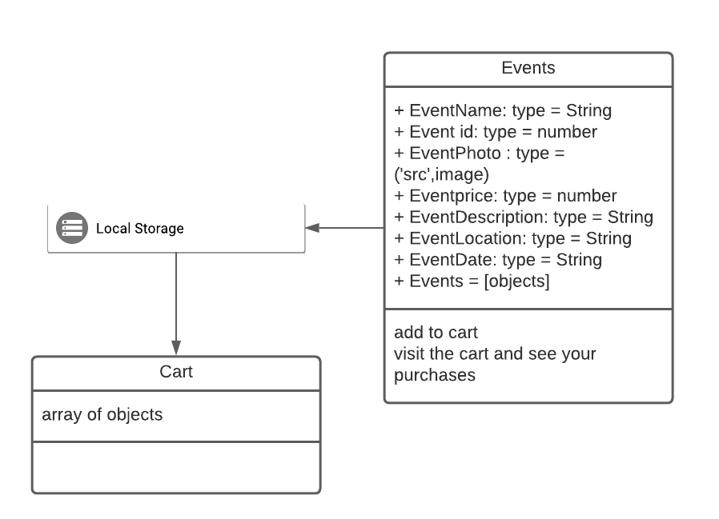
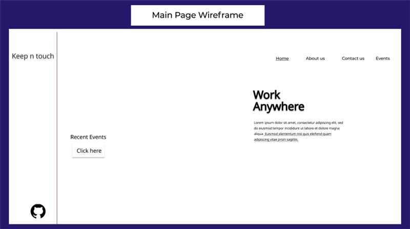
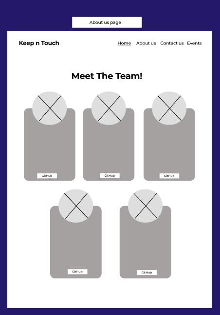
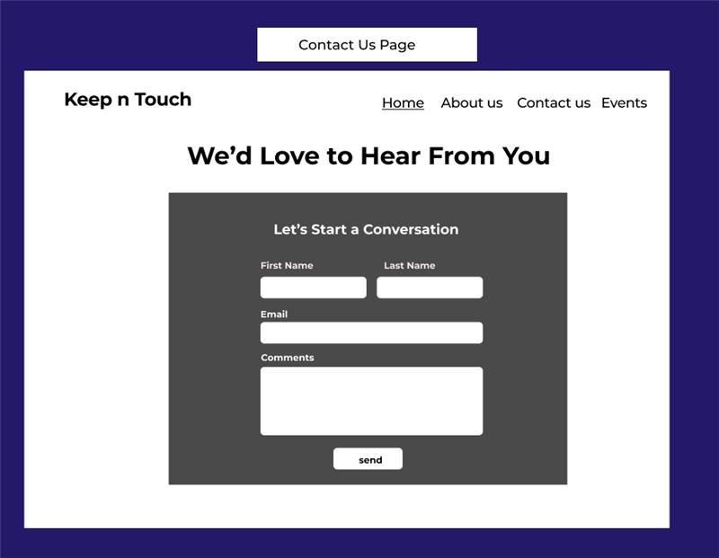
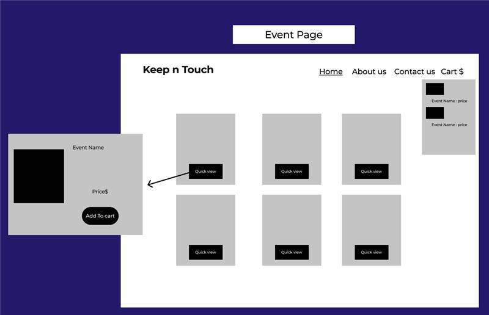
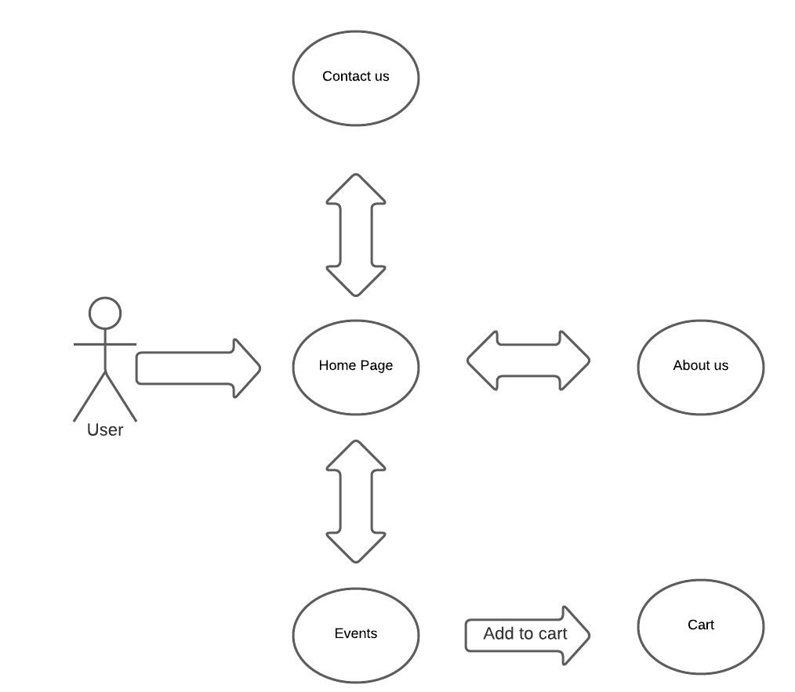

# **Task1 Solution**

## Q1.
We are a group that works for a company that sells tickets for events. The company was selling tickets face to face, and this caused some problems with the company. The manager asked us, since we are developers of websites, to create a website for the company that displays the events with their full details and sell tickets through this site, and it was The site requirements are as follows:
* Home Page.
* Contact us.
* about us.
* Events Page.
* A cart button, in which the user can see his purchases, and add or reduce the quantity.

## Q2.

When working on a project, the person or group working in this project must face challenges or risks, and the challenges or risks that we encountered during the work were as follows:
* Time Management .
* Change the plan or scope at any time.
* Code complexity.
* The user does not feel safe when using the company's website.
* Sales will decrease after creating this site.

## Q3.
**1)**
In short, the manager asked our group to create a site for selling tickets for events. This site includes some pages such as: The home page This page includes a welcome message and the side nav includes the name of the site and the github icon for the project and some buttons such as the button of the latest events page
Through which the user can learn about the events and can also book a ticket.
 About us page, the user can get acquainted with the designers and developers of the site through this page.
Contact us page, the user can express his opinion or add suggestions to our site.
The user can check his purchases through the shopping cart button and can add or reduce the quantity.
____
**2)**

____
**3)**

____
**4)**
## We used agile, what is agile?

Agile methodology is a type of project management process, primarily used for software development, in which demands and solutions evolve through the collaborative effort of self-organizing, cross-functional teams and their clients.

## Why we use agile?
Agile is an evolutionary development, giving teams a chance to learn with each iteration or new draft. Agile allows teams to prototype and improve with each cycle. Teams can manage to change priorities more effectively. Agile helps teams and people effectively prioritize work and features.

## Advantages of agile.
* Increased Flexibility with a Fast Failure Mindset.
* Improved Team Collaboration.
* Quicker & More Efficient Release Cadence.
* Greater Knowledge Building.
* More Transparency.

[Source](https://eagledream.com/news/application-modernization-news/5-advantages-agile-software-development-methodologies/)
_____
**5)**
About testing technique we didn't completed it yet, you will find it in "Stage 3".
____

