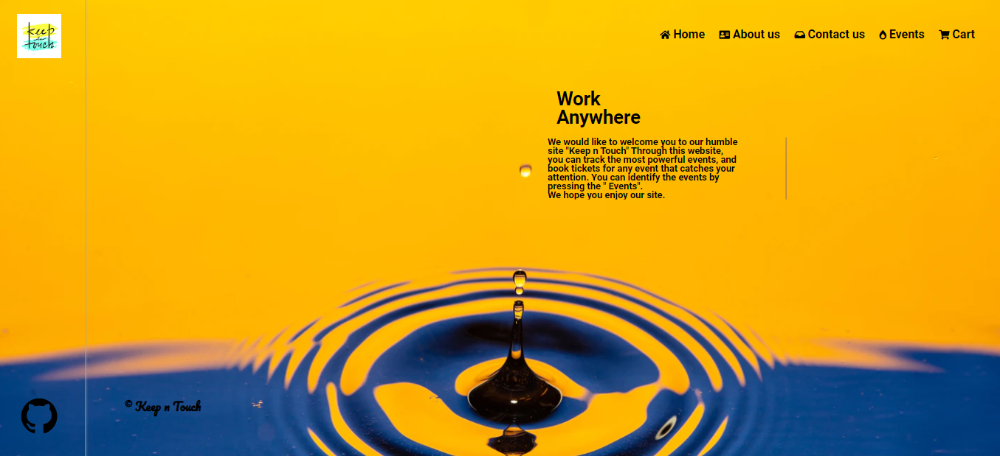
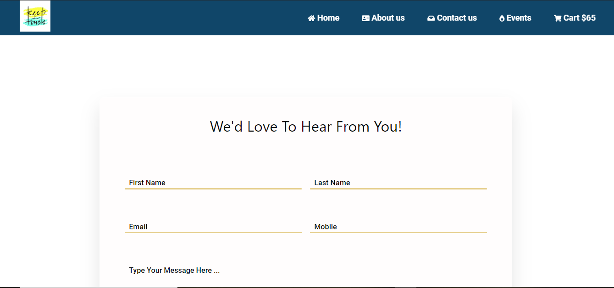
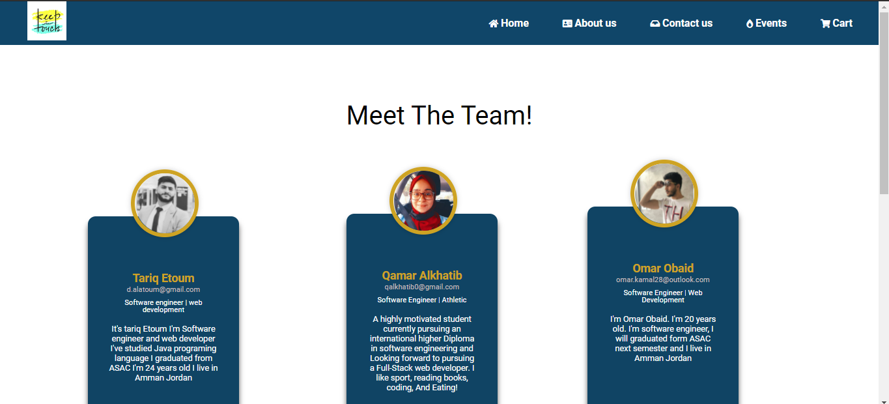
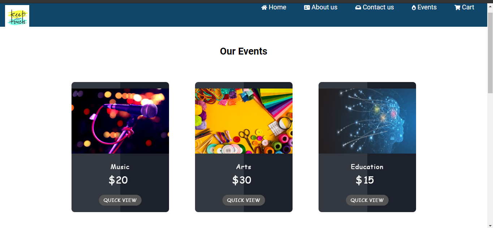
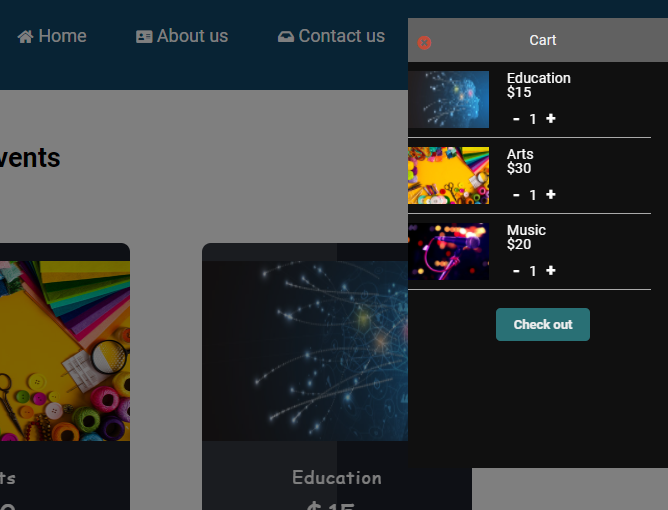

# **Stage Two Solution**

## **1) Presentation**

You Can find power piont file with submitted files.
___
## **2) Final Project**

[Live URL](https://keep-n-touch.github.io/KEEP-N-TOUCH/)

[GitHub Repo](https://github.com/KEEP-N-TOUCH/KEEP-N-TOUCH)
___
## **3) The feedback that we worked on it**

> We have to add animations for each page.

**It's done.**

> We should have the same navbar for each page. 

**It's done**

> We should add some social media icons in the footer.

**It's done**

> We should have logo to our project.

*  ## **Improvements that we did**

1- Cart page.

2- font family, font size, and navbar for each page.

* ## **Improvements that we didn't do** 

1- Video background.

2- We didn't activate "Checkout button" in cart page.

3- Slide show.
___

# **Stage Three Solution**

## **1) Requirements**

* **Home Page.**

* **Contact us.**

* **About us.**

* **Events Page.**

* **A cart button, in which the user can see his purchases, and add or reduce the quantity.**

____

## **2) How we solved the risks that we faced?**

> Time Management.

**We agreed on meeting times to work together, and organized the tasks we were going to do.**

> Change the plan or scope at any time.

**We solved this through drawing a wireframe and following it.**

> Code complexity (Conflicts).

**We face some issues with code and the the teachers assistant helped us with them.**

> The user does not feel comfirtable when using the company's website.

**We made our site simple and clear and we added a simple guide to the user.**

> Sales will decrease after creating this site.

**We explained each event and provided it with details, and we also made ticket prices cheap.**

## **3) Strenghts and Weaknesses that we have.**

> Strenghts

* Ease of use our website .
* Cart page shape was unique and also easy to use.
* we made a local storage to save the user data.

> Weaknesses

* We didn't activate "Checkout button" in cart page.
* we do not have a "Log In Page".
* We don't have a much of animation.

